<h2>Регистрация в сервисах Google и установка библиотек</h2> 
Для работы с таблицами нужно зарегистрироваться на Google, настроить проект и установить необходимые библиотеки. 
 
<a href="https://developers.google.com/sheets/">Официальная документация на английском языке находится здесь</a>. 
 
Сначала нужно зарегистрироваться на gmail.com (это вы можете сделать самостоятельно). Потом нужно создать проект (так Google предоставляет доступ к своим сервисам). 
 
Для этого зайдите на страницу <a href="https://console.developers.google.com/cloud-resource-manager">console.developers.google.com/cloud-resource-manager</a> и нажать «Создать проект» 
 
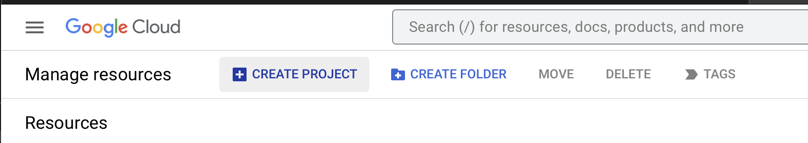 
 
Введите имя проекта и нажмите «Создать» 
 
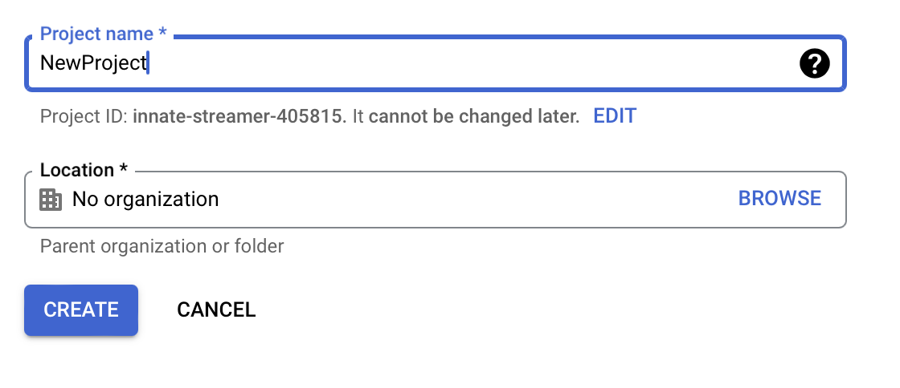 
 
В обновленном списке проектов зайдите в меню «Настройки», затем «IAM» 
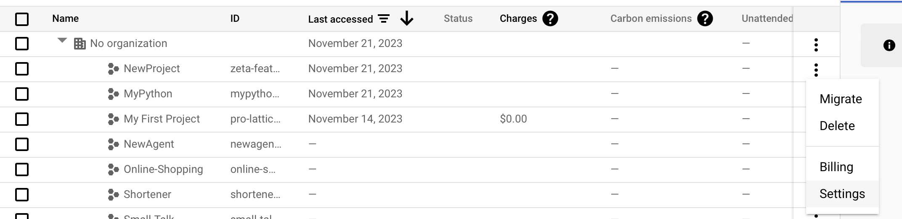 
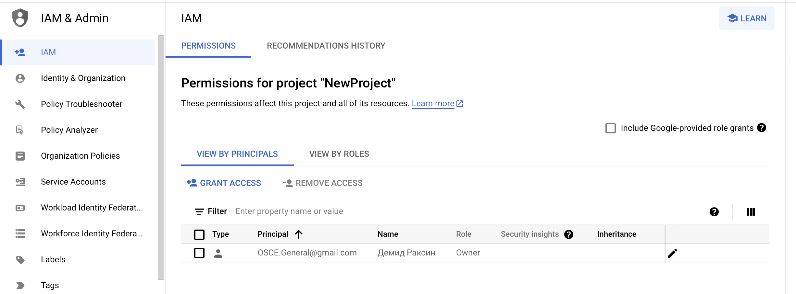 
 
В открывшемся окне нажмите «Добавить», внесите свой email с домена gmail.com и выберите группу «Проект» — «Владелец» 
 
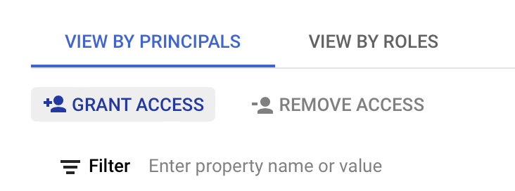 
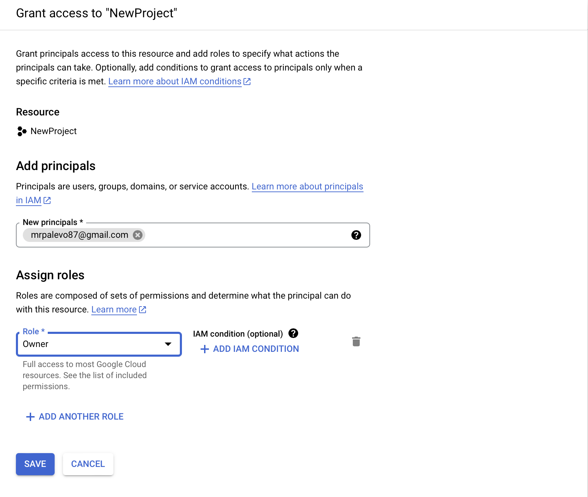 
 
Сохраните изменения. 
 
Снова зайдите на страницу <a href="https://console.developers.google.com/cloud-resource-manager">console.developers.google.com/cloud-resource-manager</a> 
 
Выберите на своем проекте меню «Настройки» 
 
 
В открывшемся окне выберите «Сервисные аккаунты», а затем «Создать сервисный аккаунт» 
 
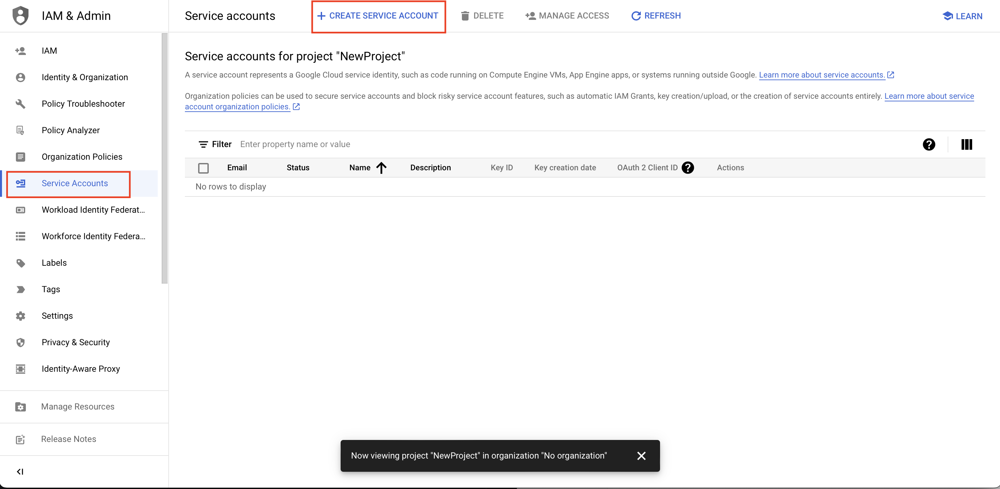 
Введите название аккаунта и нажмите «Создать» 
 
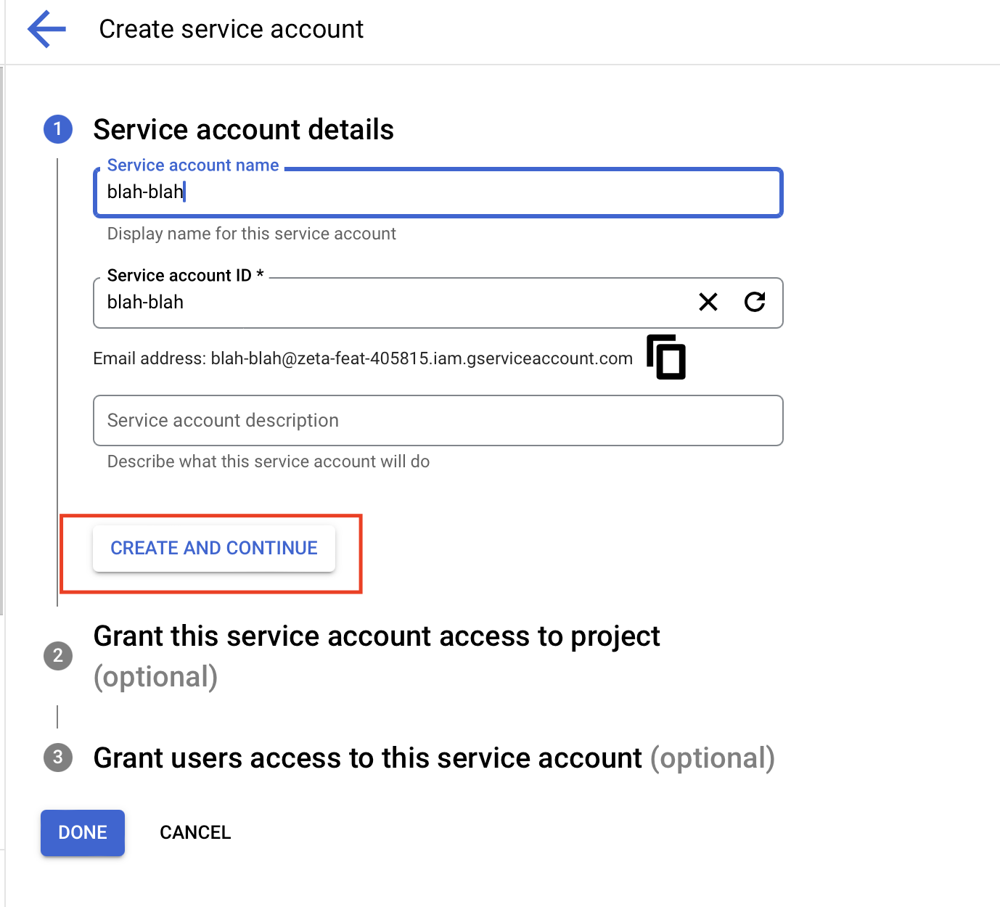 
Выберите роль «Владелец» и нажмите «Продолжить» 
 
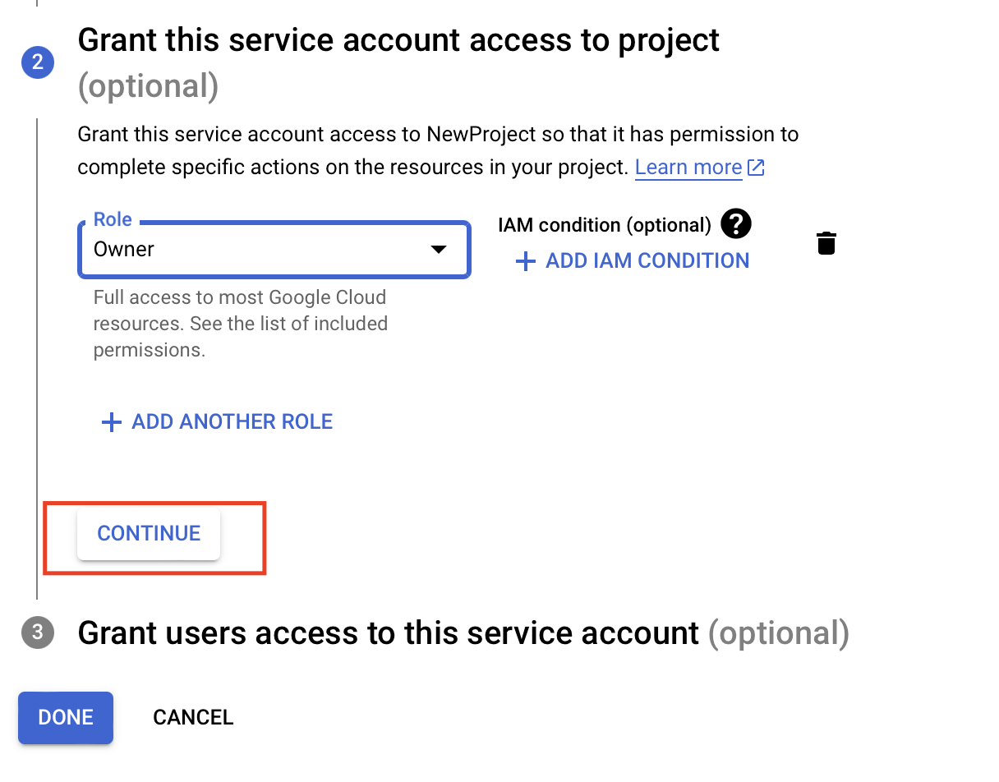 
В появившемся окне нажмите «Создать ключ» 
 
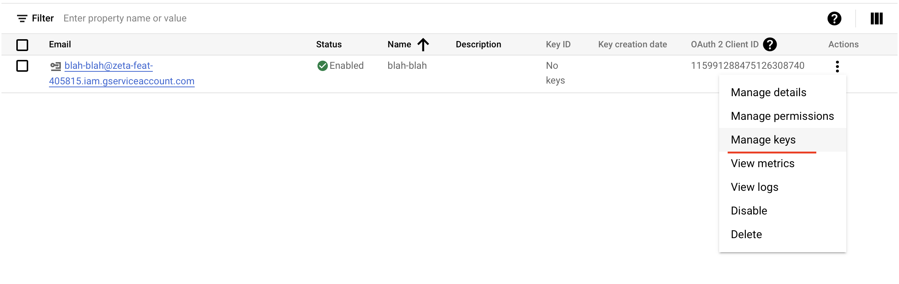 
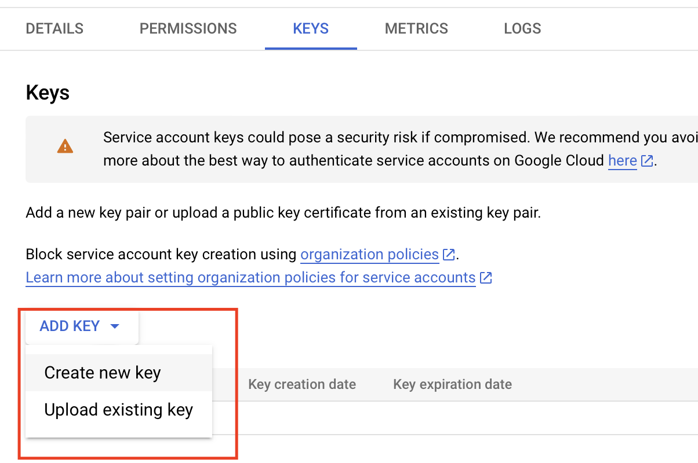 
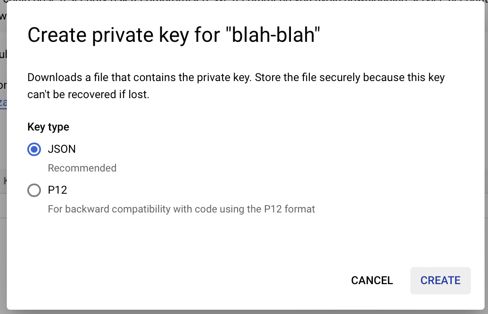 
Выберите тип ключа «json» и нажмите «Создать» 
 
Будет создан и сразу же скачан файл с ключами. Сохраните его, именно благодаря ему мы сможем получать доступ к сервисам Google. 
 
Нажмите на кнопку с тремя горизонтальными штрихами, слева от надписи «Google APIs», выберите пункт «API и сервисы», а в нем подпункт «Панель управления». 
 
 
 
В открывшемся окне нажмите «Включить API и сервисы» 
 
 
 
Введите в строку поиска «google drive» и кликните на сервисе «Google Drive API» 
 
 
 
Нажмите «Включить» 
 
 
 
Сайт уведомит вас, что API включено и предупредит, что нужно создать учетные данные. Игнорируйте это предупреждение (ведь мы уже создали сервисный аккаунт). 
 
 
 
Снова заходите в панель управления 
 
 
 
В открывшемся окне нажмите «Включить API и сервисы» 
 
 
 
Введите в строку поиска «sheet» и кликните на сервисе «Google Sheets API» 
 
 
 
Убедитесь, что это API подключено. Оно должно включиться автоматически, при подключении Google Drive API. Если оно подключено, вы увидите кнопку «Управление API», если нет — кнопку «Включить». Включите его, при необходимости. 
 
Все остальное в файлах <code>shower.py</code> и <code>async_.py</code>
